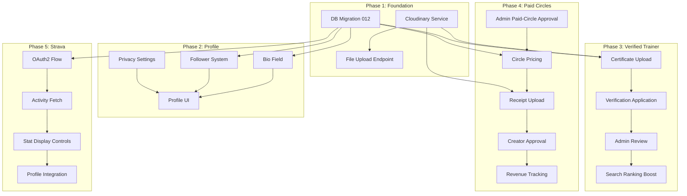

# Paid Circles, Verified Trainers & Profile/Strava Integration

Three major feature additions to Well Circle: paid circles for wellness creators, a verified trainer badge system, and profile enhancements with real Strava integration. Divided into 6 phases with clear dependencies.

---

## User Review Required

> [!IMPORTANT]
> **Cloudinary account required.** Phase 1 sets up Cloudinary for file uploads (certificates + payment receipts). You'll need a Cloudinary account — free tier supports 25k transformations/month and 25GB storage, which is more than enough.

> [!IMPORTANT]
> **Strava API application required.** Phase 5 requires a registered Strava API app at [strava.com/settings/api](https://www.strava.com/settings/api). The callback domain must match your deployed backend URL. Strava rate limits: 200 req/15min, 2000 req/day.

> [!WARNING]
> **Existing unmerged branches.** `feature/booking-ux-polish` (Phase 10) and `feature/multi-passion-onboarding-circles` (Phase 11) are still unmerged per the HANDOFF. These features should be built on `main` — a reconciliation merge of those branches should happen first to avoid conflicts, especially in [user.py](file:///home/sda1/Downloads2/wellcirclev2/backend/app/models/user.py), [circles.py](file:///home/sda1/Downloads2/wellcirclev2/backend/app/api/circles.py), and [ProfileScreen.jsx](file:///home/sda1/Downloads2/wellcirclev2/frontend/src/pages/ProfileScreen.jsx).

## Open Questions

> [!IMPORTANT]
> **Paid circle subscription period:** Is this monthly, weekly, or does the circle creator choose? This plan assumes **monthly** subscriptions — confirm or redirect.

> [!IMPORTANT]
> **Receipt approval timeout:** What happens if a circle creator never approves/rejects a receipt? This plan adds a 72-hour auto-escalation to admin — confirm this is acceptable.

> [!IMPORTANT]
> **Strava webhook vs polling:** Strava offers webhook subscriptions (push model) for activity updates. This plan uses **on-demand fetch** (pull when user visits profile) for MVP simplicity, with webhooks as a documented follow-up. Confirm this is acceptable for launch.

---

## Architecture Overview



---

## Phase 1 — Foundation: Cloudinary Service + Database Migration

**Goal:** Lay the groundwork — Cloudinary file upload service and all new database tables/columns for Phases 2–5 in a single migration.

### Backend

---

#### [NEW] [cloudinary_service.py](file:///home/sda1/Downloads2/wellcirclev2/backend/app/services/cloudinary_service.py)

Cloudinary upload wrapper. Handles certificate PDFs/images and payment receipt screenshots.

```python
# Responsibilities:
# - upload_file(file_bytes, folder, resource_type) → { url, public_id }
# - delete_file(public_id)
# - Folders: "certificates/", "receipts/"
# - Max file size: 10MB (certificates), 5MB (receipts)
# - Allowed types: certificates → pdf, jpg, png; receipts → jpg, png
```

**Environment variables (added to [config.py](file:///home/sda1/Downloads2/wellcirclev2/backend/app/config.py)):**
- `CLOUDINARY_CLOUD_NAME`
- `CLOUDINARY_API_KEY`
- `CLOUDINARY_API_SECRET`

**Dependency:** `cloudinary` added to [requirements.txt](file:///home/sda1/Downloads2/wellcirclev2/backend/requirements.txt).

---

#### [NEW] [uploads.py](file:///home/sda1/Downloads2/wellcirclev2/backend/app/api/uploads.py) — Generic file upload endpoint

```
POST /api/uploads
  Content-Type: multipart/form-data
  Body: file (binary), folder ("certificates" | "receipts")
  Response: { url: string, public_id: string }
  Auth: JWT required
```

Registered in [main.py](file:///home/sda1/Downloads2/wellcirclev2/backend/app/main.py) as `app.include_router(uploads.router, prefix="/api", tags=["Uploads"])`.

---

#### [NEW] [012_phase15_foundation.py](file:///home/sda1/Downloads2/wellcirclev2/backend/alembic/versions/012_phase15_foundation.py)

Single migration covering **all** new tables and columns for Phases 2–5. Paired with an idempotent `apply_phase15_migration.py` script per project convention.

**New columns on `users`:**

| Column | Type | Notes |
|--------|------|-------|
| `bio` | Text, nullable | Short text bio, max 300 chars |
| `is_verified_trainer` | Boolean, default false | Verified trainer badge |
| `verified_trainer_expires_at` | DateTime, nullable | Annual renewal date |
| `strava_athlete_id` | BigInteger, nullable, unique | Strava athlete ID |
| `strava_access_token` | Text, nullable | Encrypted Strava access token |
| `strava_refresh_token` | Text, nullable | Encrypted Strava refresh token |
| `strava_token_expires_at` | DateTime, nullable | Token expiry for auto-refresh |
| `strava_visible_stats` | JSONB, nullable | e.g. `["distance", "calories"]` — user controls visibility |
| `profile_privacy` | String(20), default "public" | `public` / `followers` / `private` |

**New table `followers`:**

| Column | Type | Notes |
|--------|------|-------|
| `follower_id` | UUID FK→users | Composite PK |
| `following_id` | UUID FK→users | Composite PK |
| `created_at` | DateTime | Auto |

Index on `(following_id, created_at)` for "my followers" queries.
Index on `(follower_id, created_at)` for "who I follow" queries.

**New table `trainer_verifications`:**

| Column | Type | Notes |
|--------|------|-------|
| `id` | UUID PK | |
| `user_id` | UUID FK→users, unique | One active application per user |
| `certificate_url` | Text, not null | Cloudinary URL |
| `certificate_public_id` | Text | For cleanup |
| `status` | String(20), default "pending" | `pending` / `approved` / `rejected` |
| `rejection_reason` | Text, nullable | Admin feedback |
| `payment_status` | String(20), default "pending" | `pending` / `paid` |
| `payment_receipt_url` | Text, nullable | 200 ETB receipt screenshot |
| `payment_receipt_public_id` | Text, nullable | |
| `reviewed_by` | UUID FK→users, nullable | Admin who reviewed |
| `reviewed_at` | DateTime, nullable | |
| `created_at` | DateTime | |
| `expires_at` | DateTime, nullable | Set to created_at + 1 year on approval |

**New columns on `circles`:**

| Column | Type | Notes |
|--------|------|-------|
| `is_paid` | Boolean, default false | Paid circle flag |
| `price_etb` | Integer, nullable | Monthly subscription price in ETB |
| `paid_circle_status` | String(20), default "free" | `free` / `pending_approval` / `approved` / `rejected` |
| `paid_circle_applied_at` | DateTime, nullable | When admin approval was requested |
| `total_revenue_etb` | Integer, default 0 | Lifetime revenue (denormalized for dashboard) |

**New table `circle_subscriptions`:**

| Column | Type | Notes |
|--------|------|-------|
| `id` | UUID PK | |
| `circle_id` | UUID FK→circles | |
| `user_id` | UUID FK→users | |
| `period_start` | DateTime | Current billing period start |
| `period_end` | DateTime | Current billing period end |
| `amount_etb` | Integer | Price at time of subscription |
| `status` | String(20) | `pending_receipt` / `pending_approval` / `active` / `expired` / `rejected` |
| `receipt_url` | Text, nullable | Cloudinary URL of payment screenshot |
| `receipt_public_id` | Text, nullable | |
| `creator_approved_at` | DateTime, nullable | |
| `created_at` | DateTime | |

Composite unique constraint on `(circle_id, user_id, period_start)` — one subscription per user per billing period.

**New table `circle_revenue_ledger`:**

| Column | Type | Notes |
|--------|------|-------|
| `id` | UUID PK | |
| `circle_id` | UUID FK→circles | |
| `subscription_id` | UUID FK→circle_subscriptions | |
| `total_amount_etb` | Integer | Full subscription amount |
| `creator_amount_etb` | Integer | 95% to creator |
| `platform_fee_etb` | Integer | 5% to Well Circle |
| `created_at` | DateTime | |

**New table `strava_activity_cache`:**

| Column | Type | Notes |
|--------|------|-------|
| `id` | UUID PK | |
| `user_id` | UUID FK→users, indexed | |
| `strava_activity_id` | BigInteger, unique | Strava's activity ID |
| `activity_type` | String(50) | Run, Ride, Walk, etc. |
| `distance_meters` | Float | |
| `moving_time_seconds` | Integer | |
| `elapsed_time_seconds` | Integer | |
| `total_elevation_gain` | Float | |
| `calories` | Float, nullable | Not always present |
| `start_date` | DateTime | |
| `name` | String(255) | Activity title |
| `fetched_at` | DateTime | When we last pulled this |

---

### Verification

- Migration applies cleanly against a fresh SQLite (unit tests) and the production Supabase schema
- `app.main` imports cleanly with the new models
- Upload endpoint returns correct URL structure with a mocked Cloudinary client
- **Tests:** `test_cloudinary_upload.py` — 5 tests (valid image, valid PDF, oversized file rejection, invalid type rejection, folder routing)

---

## Phase 2 — Profile Enhancements: Bio, Followers & Privacy

**Goal:** Add bio field, Instagram-style follower system, and privacy controls to user profiles.

### Backend

---

#### [MODIFY] [user.py](file:///home/sda1/Downloads2/wellcirclev2/backend/app/models/user.py) — New columns from migration

Add the `bio`, `is_verified_trainer`, `verified_trainer_expires_at`, `strava_*`, `profile_privacy` columns declared in Phase 1's migration.

#### [MODIFY] [user.py](file:///home/sda1/Downloads2/wellcirclev2/backend/app/schemas/user.py) — Schema updates

- `UserResponse` gains: `bio`, `is_verified_trainer`, `follower_count`, `following_count`, `profile_privacy`, `strava_stats` (nullable object)
- `UserProfileUpdate` gains: `bio` (max 300 chars), `profile_privacy` (enum: `public`/`followers`/`private`)

#### [NEW] [follower.py](file:///home/sda1/Downloads2/wellcirclev2/backend/app/models/follower.py) — Follower ORM model

#### [NEW] [follower.py](file:///home/sda1/Downloads2/wellcirclev2/backend/app/crud/follower.py)

```python
# Functions:
# - follow_user(db, follower_id, following_id) → Follower
# - unfollow_user(db, follower_id, following_id) → bool
# - get_followers(db, user_id, page, per_page) → (list, total)
# - get_following(db, user_id, page, per_page) → (list, total)
# - is_following(db, follower_id, following_id) → bool
# - get_follower_count(db, user_id) → int
# - get_following_count(db, user_id) → int
```

#### [NEW] [followers.py](file:///home/sda1/Downloads2/wellcirclev2/backend/app/api/followers.py)

| Method | Endpoint | Description |
|--------|----------|-------------|
| POST | `/api/users/{user_id}/follow` | Follow a user (idempotent) |
| DELETE | `/api/users/{user_id}/follow` | Unfollow a user |
| GET | `/api/users/{user_id}/followers` | Paginated follower list |
| GET | `/api/users/{user_id}/following` | Paginated following list |
| GET | `/api/users/{user_id}/profile` | Public profile (respects privacy settings) |

**Privacy enforcement in the public profile endpoint:**
- `public`: anyone sees full profile + stats
- `followers`: only followers see stats; everyone sees name/bio/badge
- `private`: only the user themselves sees stats

Registered in [main.py](file:///home/sda1/Downloads2/wellcirclev2/backend/app/main.py) as `app.include_router(followers.router, prefix="/api/users", tags=["Users"])`.

#### [MODIFY] [user.py](file:///home/sda1/Downloads2/wellcirclev2/backend/app/crud/user.py)

- `_build_response()` now includes `follower_count`, `following_count`, `bio`, `is_verified_trainer`, `profile_privacy`

#### [MODIFY] [users.py](file:///home/sda1/Downloads2/wellcirclev2/backend/app/api/users.py)

- `PATCH /users/me` accepts `bio` and `profile_privacy`

---

### Frontend

---

#### [MODIFY] [ProfileScreen.jsx](file:///home/sda1/Downloads2/wellcirclev2/frontend/src/pages/ProfileScreen.jsx)

Major additions:
1. **Bio section** — editable text area below profile name/handle. Placeholder text: *"Share your wellness journey..."*. Saves via `PATCH /users/me`.
2. **Follower stats** — `{follower_count} Followers · {following_count} Following` row below bio. Tappable to navigate to follower/following list.
3. **Privacy selector** — new section: "Profile Visibility" with 3 options (Public / Followers only / Private), saves via `PATCH /users/me`.
4. **Verified badge** — if `is_verified_trainer`, show a ✓ checkmark badge next to the user name.

#### [NEW] [FollowersList.jsx](file:///home/sda1/Downloads2/wellcirclev2/frontend/src/pages/FollowersList.jsx)

Route: `/users/:id/followers` and `/users/:id/following` (tab toggle).

Each row: avatar, name, handle, Follow/Unfollow button (if not self). Paginated scroll.

#### [NEW] [PublicProfile.jsx](file:///home/sda1/Downloads2/wellcirclev2/frontend/src/pages/PublicProfile.jsx)

Route: `/users/:id`. Shows another user's profile (respects their privacy setting). Displays:
- Avatar, name, handle, bio, verified badge
- Follower/following counts
- Follow/Unfollow button
- Strava stats (Phase 5, empty placeholder for now)
- Joined circles (if public)

#### [MODIFY] [App.jsx](file:///home/sda1/Downloads2/wellcirclev2/frontend/src/App.jsx)

New routes:
- `/users/:id` → `PublicProfile`
- `/users/:id/followers` → `FollowersList`

#### [MODIFY] [client.js](file:///home/sda1/Downloads2/wellcirclev2/frontend/src/api/client.js)

New API functions:
- `followUser(userId)`, `unfollowUser(userId)`
- `getFollowers(userId, page)`, `getFollowing(userId, page)`
- `getUserProfile(userId)`

#### [MODIFY] [mock.js](file:///home/sda1/Downloads2/wellcirclev2/frontend/src/data/mock.js)

Mock data for followers and public profiles in mock mode.

---

### Verification

- Backend: `test_followers.py` — **12 tests**: follow, unfollow, idempotent follow, self-follow rejection, follower list pagination, following list pagination, follower count accuracy, privacy enforcement (public/followers/private), bio update + length validation, profile privacy update, public profile with/without follow relationship
- Frontend: `npm run build` ✅, `npm test` — new `FollowersList.test.jsx` (4 tests), `PublicProfile.test.jsx` (5 tests), updated route smoke suite

---

## Phase 3 — Verified Trainer System

**Goal:** Users can apply for verified trainer status by uploading a certificate and paying 200 ETB annually. Admins review and approve/reject. Verified trainers get a badge + search priority.

### Backend

---

#### [NEW] [trainer_verification.py](file:///home/sda1/Downloads2/wellcirclev2/backend/app/models/trainer_verification.py)

ORM model for `trainer_verifications` table.

#### [NEW] [trainer_verification.py](file:///home/sda1/Downloads2/wellcirclev2/backend/app/schemas/trainer_verification.py)

```python
class TrainerVerificationApply(BaseModel):
    certificate_url: str          # From Cloudinary upload
    certificate_public_id: str
    payment_receipt_url: str      # 200 ETB payment receipt
    payment_receipt_public_id: str

class TrainerVerificationResponse(BaseModel):
    id: str
    status: str                   # pending / approved / rejected
    payment_status: str
    rejection_reason: Optional[str]
    created_at: datetime
    expires_at: Optional[datetime]

class AdminTrainerReviewRequest(BaseModel):
    action: str                   # "approve" | "reject"
    rejection_reason: Optional[str]
```

#### [NEW] [trainer_verification.py](file:///home/sda1/Downloads2/wellcirclev2/backend/app/crud/trainer_verification.py)

```python
# Functions:
# - apply_for_verification(db, user_id, certificate_url, ...) → TrainerVerification
# - get_verification_status(db, user_id) → TrainerVerification | None
# - get_pending_verifications(db, page, per_page) → (list, total)
# - review_verification(db, verification_id, admin_id, action, reason) → TrainerVerification
#   On approve: sets user.is_verified_trainer=True, verified_trainer_expires_at=now+1year
# - check_expired_verifications(db) → int  (for scheduler: un-verify expired trainers)
```

#### [NEW] [trainer.py](file:///home/sda1/Downloads2/wellcirclev2/backend/app/api/trainer.py)

| Method | Endpoint | Auth | Description |
|--------|----------|------|-------------|
| POST | `/api/trainer/apply` | JWT | Submit verification application (cert + receipt already uploaded via `/api/uploads`) |
| GET | `/api/trainer/status` | JWT | Check current verification status |
| GET | `/api/admin/trainer-verifications` | JWT (admin) | Paginated pending/all applications |
| POST | `/api/admin/trainer-verifications/{id}/review` | JWT (admin) | Approve or reject |

Registered in [main.py](file:///home/sda1/Downloads2/wellcirclev2/backend/app/main.py).

#### [MODIFY] [provider.py](file:///home/sda1/Downloads2/wellcirclev2/backend/app/crud/provider.py)

`get_all_providers()` — when returning provider list items alongside general search results, verified trainers (users who aren't providers but are `is_verified_trainer=True`) are boosted in relevance. However, since verified trainers are *not* providers, this change is specifically for any search/discovery surface that shows users (e.g., circle member lists, leaderboards).

#### [MODIFY] [circle.py](file:///home/sda1/Downloads2/wellcirclev2/backend/app/crud/circle.py)

`get_circles()` — circles owned by verified trainers get a `owner_is_verified` flag in the response, allowing the frontend to show a badge.

#### [MODIFY] [scheduler.py](file:///home/sda1/Downloads2/wellcirclev2/backend/app/services/scheduler.py)

Add a daily job: `check_expired_verifications()` — sets `is_verified_trainer=False` for users whose `verified_trainer_expires_at < now()`. Sends a notification via `UserNotification` ("Your trainer verification has expired — renew to keep your badge").

---

### Frontend

---

#### [NEW] [TrainerVerification.jsx](file:///home/sda1/Downloads2/wellcirclev2/frontend/src/pages/TrainerVerification.jsx)

Route: `/trainer/verify`. Multi-step flow:
1. **Intro** — explanation of benefits (badge, search priority, paid circles eligibility) + 200 ETB/year fee
2. **Upload certificate** — file picker → uploads to `/api/uploads` (folder: `certificates`) → shows preview
3. **Upload payment receipt** — file picker → uploads to `/api/uploads` (folder: `receipts`) → shows preview
4. **Review & Submit** — summary card → `POST /api/trainer/apply`
5. **Status** — shows current status (pending/approved/rejected with reason)

#### [MODIFY] [ProfileScreen.jsx](file:///home/sda1/Downloads2/wellcirclev2/frontend/src/pages/ProfileScreen.jsx)

New section: "Trainer Verification" — shows:
- If not verified: "Get Verified" CTA button → navigates to `/trainer/verify`
- If pending: "Verification pending" status pill
- If verified: "Verified Trainer ✓" badge + expiry date + "Renew" button (when < 30 days to expiry)

#### [NEW] [AdminTrainerVerifications.jsx](file:///home/sda1/Downloads2/wellcirclev2/frontend/src/pages/admin/AdminTrainerVerifications.jsx)

New admin tab: "Trainers" — pending applications list. Each card shows:
- User name, handle, avatar
- Certificate preview (clickable link to Cloudinary URL)
- Payment receipt preview
- Approve / Reject (with reason input) buttons

#### [MODIFY] [AdminLayout.jsx](file:///home/sda1/Downloads2/wellcirclev2/frontend/src/pages/admin/AdminLayout.jsx)

Add "Trainers" tab alongside existing Analytics/Providers/Products/Reports/Feedback.

#### [MODIFY] [App.jsx](file:///home/sda1/Downloads2/wellcirclev2/frontend/src/App.jsx)

New routes:
- `/trainer/verify` → `TrainerVerification`
- `/admin/trainers` → `AdminTrainerVerifications` (inside `AdminGuard`)

#### [MODIFY] [client.js](file:///home/sda1/Downloads2/wellcirclev2/frontend/src/api/client.js)

New API functions:
- `uploadFile(file, folder)` — multipart upload
- `applyForTrainerVerification(data)`
- `getTrainerVerificationStatus()`
- `getAdminTrainerVerifications(page, status)`
- `reviewTrainerVerification(id, action, reason)`

---

### Verification

- Backend: `test_trainer_verification.py` — **14 tests**: apply with valid cert+receipt, duplicate application rejection, admin approve (sets `is_verified_trainer`, sets expiry), admin reject (with reason, clears badge), expired verification cleanup (scheduler), re-application after rejection, re-application after expiry (renewal), status check for each state, missing cert/receipt 422, pagination of admin list
- Frontend: `npm run build` ✅, `npm test` — `TrainerVerification.test.jsx` (6 tests), `AdminTrainerVerifications.test.jsx` (4 tests), route smoke suite updated

---

## Phase 4 — Paid Circles

**Goal:** Circle creators can set a monthly price. Users subscribe by uploading payment receipts that the creator approves. Well Circle takes 5%. Circles must meet 100+ members and 1000+ points to apply for paid status.

### Backend

---

#### [MODIFY] [circle.py](file:///home/sda1/Downloads2/wellcirclev2/backend/app/models/circle.py)

Add columns from Phase 1 migration: `is_paid`, `price_etb`, `paid_circle_status`, `paid_circle_applied_at`, `total_revenue_etb`.

#### [NEW] [circle_subscription.py](file:///home/sda1/Downloads2/wellcirclev2/backend/app/models/circle_subscription.py)

ORM models for `circle_subscriptions` and `circle_revenue_ledger`.

#### [NEW] [circle_subscription.py](file:///home/sda1/Downloads2/wellcirclev2/backend/app/schemas/circle_subscription.py)

```python
class PaidCircleApplyRequest(BaseModel):
    price_etb: int = Field(..., gt=0, le=10000)   # Monthly price

class CircleSubscribeRequest(BaseModel):
    receipt_url: str
    receipt_public_id: str

class SubscriptionApprovalRequest(BaseModel):
    action: str    # "approve" | "reject"

class CircleRevenueResponse(BaseModel):
    total_revenue_etb: int
    creator_earnings_etb: int
    platform_fee_etb: int
    active_subscribers: int
    pending_receipts: int
    monthly_trend: list   # [{month, revenue, subscribers}]
```

#### [NEW] [circle_subscription.py](file:///home/sda1/Downloads2/wellcirclev2/backend/app/crud/circle_subscription.py)

```python
# Functions:
# - apply_for_paid_circle(db, circle_id, owner_id, price_etb) → Circle
#     Validates: circle has 100+ members AND owner has 1000+ points
#     Sets paid_circle_status="pending_approval"
#
# - subscribe_to_circle(db, circle_id, user_id, receipt_url, ...) → CircleSubscription
#     Creates subscription with status="pending_approval", period_start=now, period_end=now+30d
#
# - creator_review_subscription(db, subscription_id, owner_id, action) → CircleSubscription
#     On approve: sets status="active", creates revenue_ledger entry (95/5 split),
#     increments circle.total_revenue_etb
#     On reject: sets status="rejected"
#
# - get_pending_subscriptions(db, circle_id, owner_id) → list
#     Pending receipts for a circle owner to review
#
# - get_circle_revenue(db, circle_id, owner_id) → CircleRevenueResponse
#
# - check_expired_subscriptions(db) → int
#     For scheduler: marks subscriptions past period_end as "expired"
#
# - escalate_stale_receipts(db, hours=72) → int
#     For scheduler: receipts pending creator approval > 72h → admin notification
#
# - get_user_active_subscription(db, circle_id, user_id) → CircleSubscription | None
```

#### [MODIFY] [circles.py](file:///home/sda1/Downloads2/wellcirclev2/backend/app/api/circles.py)

New endpoints:

| Method | Endpoint | Auth | Description |
|--------|----------|------|-------------|
| POST | `/api/circles/{id}/apply-paid` | JWT (circle owner) | Apply to make circle paid |
| POST | `/api/circles/{id}/subscribe` | JWT | Subscribe + upload receipt |
| GET | `/api/circles/{id}/subscriptions/pending` | JWT (circle owner) | Pending receipts to review |
| POST | `/api/circles/subscriptions/{sub_id}/review` | JWT (circle owner) | Approve/reject receipt |
| GET | `/api/circles/{id}/revenue` | JWT (circle owner) | Revenue dashboard |
| GET | `/api/circles/{id}/subscription-status` | JWT | User's own subscription status |

Modified endpoints:

- `POST /api/circles/{id}/join` — if circle `is_paid` and user has no active subscription, return `402` with `{ detail: "Paid circle — subscription required", price_etb, circle_id }` instead of joining. Free members who joined before the circle became paid are grandfathered (their existing `CircleMember` row stays).
- `GET /api/circles` — response items gain `is_paid`, `price_etb`, `paid_circle_status`, `owner_is_verified` fields.

#### [MODIFY] [admin.py](file:///home/sda1/Downloads2/wellcirclev2/backend/app/api/admin.py)

New admin endpoints:

| Method | Endpoint | Description |
|--------|----------|-------------|
| GET | `/api/admin/paid-circle-applications` | Pending paid-circle applications |
| POST | `/api/admin/paid-circle-applications/{circle_id}/review` | Approve/reject with `{ action, reason }` |

Approval validates: circle has ≥100 members, owner has ≥1000 lifetime points (sum of positive `point_transactions`).

#### [MODIFY] [scheduler.py](file:///home/sda1/Downloads2/wellcirclev2/backend/app/services/scheduler.py)

Two new daily jobs:
1. `expire_circle_subscriptions()` — marks `period_end < now()` subscriptions as `expired`
2. `escalate_stale_receipts()` — receipts `pending_approval` for > 72 hours get an `admin_notification` created

---

### Frontend

---

#### [MODIFY] [CircleDetailScreen.jsx](file:///home/sda1/Downloads2/wellcirclev2/frontend/src/pages/CircleDetailScreen.jsx)

Major additions:
1. **Paid circle badge** — if `is_paid`, show price badge ("ETB {price}/month") below circle name
2. **Subscribe flow** — if user is not a member and circle is paid: "Subscribe (ETB {price}/mo)" button → file upload for receipt → `POST /circles/{id}/subscribe` → "Receipt submitted — awaiting approval" status
3. **Subscription status** — if user has pending/active/expired subscription, show appropriate status pill
4. **Owner: Revenue tab** — new tab (alongside Activity / Leaderboard / Members): revenue stats, pending receipts with approve/reject UI
5. **Owner: Apply for paid** — if circle is free and has 100+ members: "Monetize this circle" CTA in settings → price picker → `POST /circles/{id}/apply-paid`

#### [NEW] [AdminPaidCircles.jsx](file:///home/sda1/Downloads2/wellcirclev2/frontend/src/pages/admin/AdminPaidCircles.jsx)

Admin tab: "Paid Circles" — pending applications. Each card shows:
- Circle name, member count, owner name/handle
- Owner's lifetime points
- Requested price
- Approve / Reject buttons

#### [MODIFY] [AdminLayout.jsx](file:///home/sda1/Downloads2/wellcirclev2/frontend/src/pages/admin/AdminLayout.jsx)

Add "Paid Circles" tab.

#### [MODIFY] [App.jsx](file:///home/sda1/Downloads2/wellcirclev2/frontend/src/App.jsx)

New route: `/admin/paid-circles` → `AdminPaidCircles` (inside `AdminGuard`).

#### [MODIFY] [client.js](file:///home/sda1/Downloads2/wellcirclev2/frontend/src/api/client.js)

New functions:
- `applyForPaidCircle(circleId, priceEtb)`
- `subscribeToCircle(circleId, receiptUrl, receiptPublicId)`
- `getPendingSubscriptions(circleId)`
- `reviewSubscription(subscriptionId, action)`
- `getCircleRevenue(circleId)`
- `getSubscriptionStatus(circleId)`
- `getAdminPaidCircleApplications(page)`
- `reviewPaidCircleApplication(circleId, action, reason)`

---

### Verification

- Backend: `test_paid_circles.py` — **20 tests**: apply for paid (success, under 100 members rejection, under 1000 points rejection), admin approve/reject paid application, subscribe with receipt, creator approve receipt (revenue ledger entry created, 95/5 split correct), creator reject receipt, join blocked for non-subscriber on paid circle, grandfathered free member access, expired subscription blocks access, stale receipt escalation, duplicate subscription prevention, revenue calculation accuracy, circle revenue dashboard data, subscription status check, re-subscribe after expiry
- Frontend: `npm run build` ✅, `npm test` — `CircleDetailScreen.paid.test.jsx` (8 tests), `AdminPaidCircles.test.jsx` (4 tests), route smoke suite updated

---

## Phase 5 — Strava Integration

**Goal:** Full OAuth2 Strava integration. Users connect their Strava account, choose which stats to display on their profile, and their activity data is fetched on demand.

### Backend

---

#### [NEW] [strava_service.py](file:///home/sda1/Downloads2/wellcirclev2/backend/app/services/strava_service.py)

Core Strava API wrapper:

```python
# Constants:
STRAVA_AUTH_URL = "https://www.strava.com/oauth/authorize"
STRAVA_TOKEN_URL = "https://www.strava.com/api/v3/oauth/token"
STRAVA_API_BASE = "https://www.strava.com/api/v3"

# Functions:
# - get_authorization_url(state) → str
#     Builds OAuth redirect URL with scope "read,activity:read_all"
#
# - exchange_code(code) → { access_token, refresh_token, expires_at, athlete }
#     POST to token endpoint with authorization_code grant
#
# - refresh_token_if_needed(db, user) → str (valid access_token)
#     Checks user.strava_token_expires_at, refreshes if expired
#
# - get_athlete_stats(access_token, athlete_id) → dict
#     GET /athletes/{id}/stats — all-time + recent totals
#     Returns: { all_ride_totals, all_run_totals, all_swim_totals,
#                recent_ride_totals, recent_run_totals, recent_swim_totals,
#                ytd_ride_totals, ytd_run_totals, ytd_swim_totals }
#
# - get_recent_activities(access_token, per_page=10) → list
#     GET /athlete/activities — most recent activities
#
# - disconnect(db, user) → None
#     Clears all strava_* fields on user, deletes cached activities
```

**Environment variables:**
- `STRAVA_CLIENT_ID`
- `STRAVA_CLIENT_SECRET`
- `STRAVA_REDIRECT_URI` (e.g. `https://your-backend.onrender.com/api/strava/callback`)

#### [NEW] [strava.py](file:///home/sda1/Downloads2/wellcirclev2/backend/app/api/strava.py)

| Method | Endpoint | Auth | Description |
|--------|----------|------|-------------|
| GET | `/api/strava/connect` | JWT | Returns Strava OAuth authorization URL. `state` param contains encrypted user ID for CSRF protection |
| GET | `/api/strava/callback` | None (OAuth redirect) | Strava redirects here with `code` + `state`. Exchanges code for tokens, stores on user, redirects to frontend `/profile?strava=connected` |
| POST | `/api/strava/disconnect` | JWT | Clears Strava tokens, deletes cached activities |
| GET | `/api/strava/stats` | JWT | Returns athlete stats + recent activities (auto-refreshes token). Caches activities in `strava_activity_cache` |
| PATCH | `/api/strava/visibility` | JWT | Update `strava_visible_stats`. Body: `{ visible_stats: ["distance", "calories", "moving_time", "elevation", "activity_count"] }` |

**Available stat keys** for `strava_visible_stats`:
- `distance` — total distance (km)
- `calories` — total calories burned
- `moving_time` — total active time
- `elevation` — total elevation gain (m)
- `activity_count` — number of activities
- `recent_activities` — show last 5 activities list

Registered in [main.py](file:///home/sda1/Downloads2/wellcirclev2/backend/app/main.py).

#### [MODIFY] [users.py](file:///home/sda1/Downloads2/wellcirclev2/backend/app/api/users.py) — Profile endpoint changes

`GET /api/users/{user_id}/profile` (from Phase 2) now includes Strava stats based on:
1. User has Strava connected (`strava_athlete_id` is not null)
2. `strava_visible_stats` controls which stats are included
3. Privacy settings apply (public = everyone sees; followers = only followers; private = only self)

#### [NEW] [strava_activity_cache.py](file:///home/sda1/Downloads2/wellcirclev2/backend/app/models/strava_activity_cache.py)

ORM model for cached activities.

#### [NEW] [strava.py](file:///home/sda1/Downloads2/wellcirclev2/backend/app/crud/strava.py)

```python
# Functions:
# - cache_activities(db, user_id, activities) → list
# - get_cached_activities(db, user_id, limit=10) → list
# - get_aggregated_stats(db, user_id) → dict   # sum from cache
# - clear_user_cache(db, user_id) → int
```

---

### Frontend

---

#### [MODIFY] [ProfileScreen.jsx](file:///home/sda1/Downloads2/wellcirclev2/frontend/src/pages/ProfileScreen.jsx)

Replace the existing "Health & Activity" section (currently a wishlist vote) with a real Strava integration section:

**State: Not connected**
- Strava logo + "Connect with Strava" button (opens `GET /api/strava/connect` URL via `Telegram.WebApp.openLink()` or `window.open()`)

**State: Connected**
- "Connected to Strava ✓" header + Disconnect button
- **Stat visibility toggles** — checkboxes for each stat category (distance, calories, moving time, elevation, activity count, recent activities). Saves via `PATCH /api/strava/visibility`
- **Stats preview** — shows the stats exactly as they'll appear on the public profile

**Strava callback handling:**
- When redirected to `/profile?strava=connected`, show a success toast and refresh user data

#### [MODIFY] [PublicProfile.jsx](file:///home/sda1/Downloads2/wellcirclev2/frontend/src/pages/PublicProfile.jsx) (from Phase 2)

Strava stats section:
- Stat cards in a responsive grid (distance in km, calories, active time in hours, elevation in meters)
- "Recent Activities" list (if user enabled): activity name, type icon, distance, time, date
- Strava attribution badge (required by Strava API terms): "Powered by Strava" with logo

#### [MODIFY] [client.js](file:///home/sda1/Downloads2/wellcirclev2/frontend/src/api/client.js)

New functions:
- `getStravaConnectUrl()`
- `disconnectStrava()`
- `getStravaStats()`
- `updateStravaVisibility(visibleStats)`
- `getUserStravaStats(userId)` — for public profiles

#### [MODIFY] [mock.js](file:///home/sda1/Downloads2/wellcirclev2/frontend/src/data/mock.js)

Mock Strava data for dev/test mode.

---

### Verification

- Backend: `test_strava_integration.py` — **16 tests**: OAuth URL generation (correct scopes + state), token exchange (mocked Strava API), token refresh when expired, athlete stats fetch (mocked), recent activities fetch + caching, disconnect (clears tokens + cache), visibility update (valid stats, invalid stat rejection), stats endpoint respects visibility settings, stats endpoint respects privacy settings (public/followers/private), rate limit handling (429 from Strava → graceful error), expired token auto-refresh flow, activity cache TTL logic, empty stats for new connection
- Frontend: `npm run build` ✅, `npm test` — `ProfileScreen.strava.test.jsx` (6 tests: connect button, disconnect, visibility toggles, callback toast), `PublicProfile.strava.test.jsx` (4 tests: stats display, privacy gating, Strava attribution), route smoke suite updated

---

## Phase 6 — Integration Testing, Polish & Documentation

**Goal:** End-to-end integration, cross-feature interactions, performance, and documentation.

### Cross-Feature Integration Tests

#### [NEW] [test_cross_feature.py](file:///home/sda1/Downloads2/wellcirclev2/backend/app/tests/test_cross_feature.py)

**12 integration tests** covering feature interactions:
1. Verified trainer creates a paid circle → badge shows on circle
2. User follows a verified trainer → sees their Strava stats (if public)
3. User follows a trainer with private stats → stats hidden
4. Paid circle subscription → revenue ledger accuracy across multiple subscribers
5. Expired trainer verification → paid circles remain active (don't cascade-disable)
6. Admin approves paid circle → circle appears as paid in browse
7. Admin rejects paid circle application → creator gets notification
8. Strava-connected user's stats appear correctly on public profile
9. Circle subscriber's receipt approved → they can access circle activity feed
10. Grandfathered free member of now-paid circle retains access
11. Follower count accuracy after follow/unfollow cycles
12. Bio update persists across sessions

### Performance Verification

- **N+1 query audit:** follower counts, circle subscription status checks, and Strava stats must be batched — no per-item queries in list endpoints. Following the Phase 6 precedent (batched provider/community queries).
- **Strava rate limiting:** enforce a per-user cache TTL of 15 minutes — don't re-fetch stats on every profile view.

### Documentation Updates

#### [MODIFY] [API_CONTRACT.md](file:///home/sda1/Downloads2/wellcirclev2/docs/API_CONTRACT.md)

New sections:
- `## 10. Followers` — follow/unfollow/list/public-profile endpoints
- `## 11. Trainer Verification` — apply/status/admin-review endpoints
- `## 12. Paid Circles` — apply-paid/subscribe/review/revenue endpoints
- `## 13. Strava Integration` — connect/callback/disconnect/stats/visibility endpoints
- `## 14. File Uploads` — generic upload endpoint

Updated sections:
- `## 3. Users` — `UserResponse` schema updated with new fields
- Quick Reference table updated with all new endpoints

#### [MODIFY] [HANDOFF.md](file:///home/sda1/Downloads2/wellcirclev2/docs/HANDOFF.md)

New Phase 15 entry covering all changes, following the established format.

#### [MODIFY] [.env.example](file:///home/sda1/Downloads2/wellcirclev2/backend/.env.example)

New environment variables:
```
# Cloudinary (file uploads)
CLOUDINARY_CLOUD_NAME=
CLOUDINARY_API_KEY=
CLOUDINARY_API_SECRET=

# Strava (OAuth integration)
STRAVA_CLIENT_ID=
STRAVA_CLIENT_SECRET=
STRAVA_REDIRECT_URI=https://your-backend.onrender.com/api/strava/callback
```

### Cloudinary Setup Steps (Post-Implementation)

> [!NOTE]
> These steps should be followed after all code is implemented and tested:

1. **Create Cloudinary account** at [cloudinary.com/users/register_free](https://cloudinary.com/users/register_free)
2. From the Dashboard, copy `Cloud Name`, `API Key`, `API Secret`
3. Set these as environment variables in your deployment platform (Render/Vercel)
4. **Strava:** Create API app at [strava.com/settings/api](https://www.strava.com/settings/api)
5. Set `Authorization Callback Domain` to your backend's domain (e.g. `your-backend.onrender.com`)
6. Copy `Client ID` and `Client Secret` to env vars
7. Set `STRAVA_REDIRECT_URI` to `https://your-backend.onrender.com/api/strava/callback`
8. **Run migrations** against production Supabase:
   ```bash
   python apply_phase15_migration.py
   ```

---

## Verification Plan

### Automated Tests

```bash
# Backend — all new test suites
python -m app.tests.test_cloudinary_upload       # Phase 1: 5 tests
python -m app.tests.test_followers               # Phase 2: 12 tests
python -m app.tests.test_trainer_verification    # Phase 3: 14 tests
python -m app.tests.test_paid_circles            # Phase 4: 20 tests
python -m app.tests.test_strava_integration      # Phase 5: 16 tests
python -m app.tests.test_cross_feature           # Phase 6: 12 tests

# Backend — regression (existing tests must still pass)
python -m app.tests.test_integration
python -m app.tests.test_points_economy
python -m app.tests.test_presale_reentry
python -m app.tests.test_engagement_loop
python -m app.tests.test_circle_activity
python -m app.tests.test_ranks
python -m app.tests.test_feedback
python -m app.tests.test_user_prefs

# Frontend
npm run build                                     # Zero warnings
npm test                                          # All tests pass (existing + new)
```

**Expected test counts:**
- New backend tests: **79 tests** across 6 files
- New frontend tests: ~**37 tests** across 8 files
- Existing tests: all must continue passing (145 frontend, 100+ backend)

### Manual Verification

Recommended `npm run dev` walkthrough before shipping:
1. Edit bio on Profile → verify it persists on reload
2. Follow/unfollow a user → counts update in real time
3. View public profile with privacy set to "followers" (from a non-follower) → stats hidden
4. Complete trainer verification flow: upload cert → upload receipt → submit → admin approve → badge appears
5. Create a circle → grow to 100 members (seed) → apply for paid → admin approve → set price → user subscribes with receipt → creator approves → user gains access
6. Connect Strava → toggle stat visibility → view own profile → disconnect
7. Visit another user's profile with Strava stats → verify Strava attribution badge

---

## File Summary

### New Files (24)
```
backend/app/services/cloudinary_service.py
backend/app/services/strava_service.py
backend/app/api/uploads.py
backend/app/api/followers.py
backend/app/api/trainer.py
backend/app/api/strava.py
backend/app/models/follower.py
backend/app/models/trainer_verification.py
backend/app/models/circle_subscription.py
backend/app/models/strava_activity_cache.py
backend/app/schemas/trainer_verification.py
backend/app/schemas/circle_subscription.py
backend/app/crud/follower.py
backend/app/crud/trainer_verification.py
backend/app/crud/circle_subscription.py
backend/app/crud/strava.py
backend/alembic/versions/012_phase15_foundation.py
backend/apply_phase15_migration.py
backend/app/tests/test_cloudinary_upload.py
backend/app/tests/test_followers.py
backend/app/tests/test_trainer_verification.py
backend/app/tests/test_paid_circles.py
backend/app/tests/test_strava_integration.py
backend/app/tests/test_cross_feature.py
frontend/src/pages/FollowersList.jsx
frontend/src/pages/PublicProfile.jsx
frontend/src/pages/TrainerVerification.jsx
frontend/src/pages/admin/AdminTrainerVerifications.jsx
frontend/src/pages/admin/AdminPaidCircles.jsx
frontend/src/test/FollowersList.test.jsx
frontend/src/test/PublicProfile.test.jsx
frontend/src/test/PublicProfile.strava.test.jsx
frontend/src/test/TrainerVerification.test.jsx
frontend/src/test/AdminTrainerVerifications.test.jsx
frontend/src/test/AdminPaidCircles.test.jsx
frontend/src/test/CircleDetailScreen.paid.test.jsx
frontend/src/test/ProfileScreen.strava.test.jsx
```

### Modified Files (21)
```
backend/requirements.txt
backend/.env.example
backend/app/config.py
backend/app/main.py
backend/app/models/user.py
backend/app/models/circle.py
backend/app/models/__init__.py
backend/app/schemas/user.py
backend/app/crud/user.py
backend/app/crud/circle.py
backend/app/crud/provider.py
backend/app/api/users.py
backend/app/api/circles.py
backend/app/api/admin.py
backend/app/services/scheduler.py
frontend/src/App.jsx
frontend/src/pages/ProfileScreen.jsx
frontend/src/pages/CircleDetailScreen.jsx
frontend/src/pages/admin/AdminLayout.jsx
frontend/src/api/client.js
frontend/src/data/mock.js
docs/API_CONTRACT.md
docs/HANDOFF.md
```
